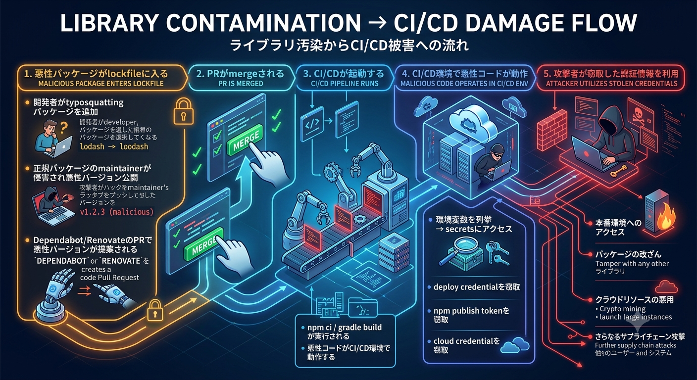

# 第4回：CI/CD・Secrets・リリース経路 — ライブラリ汚染の被害拡大を防ぐ

# この回の目的

> ライブラリ汚染の被害がCI/CD上で拡大する仕組みを理解し、CodePipeline / CodeBuildにおける権限分離、認証情報の最小化、リリース経路の保護を学ぶ。成果物としてCI/CD防御チェックリストを作成する。

# 1. CI/CDが攻撃者にとって価値の高い理由
## 1.1 CI/CD環境に集まるもの

CI/CD環境、ここではAWS CodePipeline / CodeBuildを主な例とする。

CI/CD環境には、攻撃者にとって価値の高いものが集まっている。

```text
CI/CD環境にあるもの:

  権限:
    - repositoryへの読み取り権限
    - package registryへのpublish権限
    - cloud環境へのdeploy権限
    - container registryへのpush権限
    - S3 / ECR / ECS / CloudFormation等への操作権限

  認証情報:
    - npm publish token
    - Maven/Gradle deploy credential
    - 外部SaaSのAPI token
    - Docker registry credential
    - signing key
    - Secrets Manager / Parameter Storeから取得されるsecret

  成果物:
    - build artifact（JAR, Docker image等）
    - dependency cache
    - build cache
    - CodePipeline artifact

  自動化:
    - 人間が毎回中身を確認しない
    - repositoryへのpush/mergeをトリガーに自動実行
    - 定期実行
    - 承認後の自動deploy
```

## 1.2 攻撃者の視点

攻撃者にとって、CI/CD環境の侵害は以下の理由で価値が高い。

| 理由 | 説明 |
|------|------|
| 権限の集中 | deploy, publish, cloud accessの権限が一箇所に集まっている |
| 自動実行 | 人間の確認なしに動作するため、検知されにくい |
| 信頼の連鎖 | CIでビルドされた成果物は「信頼されたもの」として扱われがち |
| 持続性 | CI cacheやartifactに悪性コードを残せば、繰り返し実行される |
| 横展開 | 一つのsecretから他のシステムへのアクセスが可能 |

# 2. ライブラリ汚染とCI/CDの関係
## 2.1 被害拡大の流れ

第2回・第3回で学んだライブラリ汚染が、CI/CD上でどのように被害拡大するかを整理する。

```text
ライブラリ汚染 → CI/CD被害拡大の流れ:

  1. 悪性パッケージがlockfileに入る
     - 開発者がtyposquattingパッケージを追加
     - 正規パッケージのmaintainerが侵害され悪性バージョン公開
     - 自動更新PRで悪性バージョンが提案される

  2. PRがmergeされる

  3. CI/CDが起動する
     - CodePipelineがSource変更を検知する
     - CodeBuildで npm ci / gradle build が実行される
     - 悪性コードがCI/CD環境で動作する

  4. CI/CD環境で悪性コードが動作
     - 環境変数を列挙する
     - CodeBuild Service Roleの権限を悪用する
     - npm publish tokenを窃取する
     - 外部SaaS tokenを窃取する
     - AWS APIを不正操作する

  5. 攻撃者が窃取した認証情報や権限を利用
     - 本番環境へのアクセス
     - パッケージの改ざん
     - クラウドリソースの悪用
     - さらなるサプライチェーン攻撃
```



## 2.2 分離されていない場合の問題

CI/CDのStageやCodeBuild Projectが分離されていないと、テスト用の処理にdeploy用の権限やsecretsが渡される。

```yaml
# 問題のある構成：1つのCodeBuild Projectにtest/build/deployが全て入っている
version: 0.2

# このProjectのService Roleに、本番S3 deploy権限やsecret取得権限が付いている想定
env:
  secrets-manager:
    NODE_AUTH_TOKEN: "prod/npm:NPM_TOKEN"
    EXTERNAL_API_TOKEN: "prod/external-api:TOKEN"

phases:
  install:
    runtime-versions:
      nodejs: 20
    commands:
      - npm ci                    # ← ここで悪性コードが実行される可能性がある

  build:
    commands:
      - npm test
      - npm run build
      - npm publish               # ← このためにNPM_TOKENがProjectに渡されている
      - aws s3 sync dist/ s3://your-production-bucket --delete
                                   # ← このためにService Roleへ本番deploy権限が付いている
```

この構成では、`npm ci`の時点でCodeBuild実行環境にsecretsや本番deploy権限が存在するため、悪性コードがそれらにアクセスできる可能性がある。

# 3. CodePipeline / CodeBuildの権限設計
## 3.1 CodeBuildの権限はIAM Roleで決まる

CodeBuildの権限は、主にIAM Roleで決まる。

```text
CodePipeline / CodeBuildの権限を決める場所:

  CodePipeline Service Role:
    - Source / Build / DeployなどのActionを起動する権限
    - artifact bucketを読み書きする権限
    - CodeBuildを起動する権限

  CodeBuild Service Role:
    - build中にAWS APIを呼び出す権限
    - CloudWatch Logsへログを書き込む権限
    - CodePipeline artifact bucketを読み書きする権限
    - Secrets Manager / Parameter Storeからsecretを読む権限
    - S3 / ECR / ECS / CloudFormation等へのdeploy権限

  CodeConnections:
    - 外部repositoryからsourceを取得する接続
```

**CodeBuildでは、ProjectごとにService Roleを分け、必要最小限のIAM権限だけを付与することが重要である。**

## 3.2 Test用Projectは最小権限にする

テストだけを実行するCodeBuild Projectでは、source artifactを読み、ログを書き、必要に応じてtest resultを出力できれば十分である。

```yaml
# buildspec-test.yml
version: 0.2

phases:
  install:
    runtime-versions:
      nodejs: 20
    commands:
      - npm ci

  build:
    commands:
      - npm test
```

Test用CodeBuild Service Roleの考え方：

```json
{
  "Version": "2012-10-17",
  "Statement": [
    {
      "Sid": "WriteCodeBuildLogs",
      "Effect": "Allow",
      "Action": [
        "logs:CreateLogGroup",
        "logs:CreateLogStream",
        "logs:PutLogEvents"
      ],
      "Resource": "*"
    },
    {
      "Sid": "ReadWritePipelineArtifacts",
      "Effect": "Allow",
      "Action": [
        "s3:GetObject",
        "s3:GetObjectVersion",
        "s3:PutObject"
      ],
      "Resource": "arn:aws:s3:::your-codepipeline-artifact-bucket/*"
    }
  ]
}
```

このRoleには、本番S3へのdeploy権限、ECS update-service権限、ECR push権限、Secrets Managerの本番secret取得権限などを付与しない。

## 3.3 主要なIAM権限

| 権限 | 説明 | Test/Buildで必要か |
|------|------|--------------------|
| `logs:CreateLogStream`, `logs:PutLogEvents` | CodeBuildログ出力 | 必要 |
| `s3:GetObject` | CodePipeline artifact取得 | 必要 |
| `s3:PutObject` | CodePipeline artifact出力 | Buildでは必要 |
| `secretsmanager:GetSecretValue` | Secrets Managerの値を取得 | Testでは原則不要 |
| `ssm:GetParameter` | Parameter Storeの値を取得 | Testでは原則不要 |
| `ecr:PutImage` | ECRへimage push | container build/publish時のみ |
| `ecs:UpdateService` | ECS service更新 | Deploy時のみ |
| `cloudformation:*` | stack更新 | Deploy時のみ |
| `s3:PutObject`, `s3:DeleteObject` | S3へ静的ファイルdeploy | Deploy時のみ |

## 3.4 Stage / Project単位でRoleを分ける

CodePipeline / CodeBuildでは、StageとCodeBuild Projectを分けて権限を分離する。

```text
CodePipeline
  Source
    - CodeConnections / CodeCommit等
    - Output: SourceArtifact

  Test
    - CodeBuild Project: app-test
    - Buildspec: buildspec-test.yml
    - Role: codebuild-test-role
    - secrets: なし

  Build
    - CodeBuild Project: app-build
    - Buildspec: buildspec-build.yml
    - Role: codebuild-build-role
    - Output: BuildArtifact

  Approval
    - Manual approval
    - 本番反映前に承認を要求

  Deploy
    - CodeBuild Project: app-deploy
    - Buildspec: buildspec-deploy.yml
    - Role: codebuild-deploy-role
    - Input: BuildArtifact
    - deploy権限のみ付与
```

# 4. Deploy StageとTest Stageの分離
## 4.1 分離の原則

**「依存関係をinstallしてテストする処理」と「deployやpublishの権限を持つ処理」を分離する。**

```text
推奨構成：CodePipelineのStageとCodeBuild Projectを分離

CodePipeline
  1. Source
     - SourceArtifactを出力

  2. Test
     - npm ci
     - npm test
     - secretsなし
     - deploy権限なし

  3. Build
     - npm ci
     - npm run build
     - BuildArtifactを出力
     - deploy権限なし

  4. Approval
     - Manual approval
     - 本番反映前の承認

  5. Deploy
     - BuildArtifactを受け取る
     - npm ci は実行しない
     - deployのみ実行
     - deployに必要なRoleだけ付与
```

## 4.2 Manual approvalによる保護

CodePipelineでは、Deploy Stageの前にManual approvalを置くことで、本番反映前に承認を要求できる。

```text
CodePipeline
  Source
    ↓
  Test
    ↓
  Build
    ↓
  ManualApproval
    ↓
  Deploy
```

Manual approvalで確認すること：

- **変更内容** — 本番へ反映してよい変更か
- **Build/Test結果** — 必要なテストが通っているか
- **Artifact** — Deploy対象がBuild Stageから出力された成果物か
- **変更元branch** — 信頼済みbranchからの変更か
- **緊急度** — 通常リリースか、緊急リリースか

Deploy用の認証情報や権限は、Deploy用CodeBuild Projectだけが参照できるようにする。

## 4.3 分離のポイント

```text
分離の考え方:

  npm ci / gradle build を実行するStage
    → 悪性コードが実行される可能性がある
    → secretsを渡さない
    → Service Roleを最小にする
    → deploy権限を付けない

  deploy / publish を実行するStage
    → 必要なsecrets/permissionsを持つ
    → npm ci / gradle build を実行しない
    → ビルド済みartifactを受け取って使う
    → Manual approval後に実行する
```

# 5. Secretsの管理
## 5.1 Secretsのスコープ

CodePipeline / CodeBuildでは、secretsや権限のスコープを以下のように分ける。

| スコープ | 設定場所 | アクセス範囲 |
|---------|---------|------------|
| AWS IAM Role | CodeBuild Project / CodePipeline | そのProjectやPipelineが実行できるAWS操作 |
| Secrets Manager | secret単位 | IAMで許可されたRoleのみ取得可能 |
| Parameter Store | parameter単位 | IAMで許可されたRoleのみ取得可能 |
| CodeBuild environment variables | CodeBuild Project | そのProjectのbuild中に参照可能 |
| CodePipeline artifact bucket | S3 | Pipelineと各Actionがartifactを受け渡す |

**secretsは最も狭いスコープで設定すべきである。**

```text
推奨:
  deploy credential → Deploy用CodeBuild ProjectのService Roleだけが取得可能
  npm publish token → Publish用CodeBuild ProjectのService Roleだけが取得可能
  テスト用API key  → Test専用の低権限secretに限定
  AWS deploy権限   → 長期アクセスキーではなくDeploy用Service Roleに付与
```

## 5.2 不要なSecretsの排除

CI/CDのsecrets一覧を定期的に棚卸しし、不要なsecretsを削除する。

確認ポイント：

```text
□ 各secretが実際に使われているか
□ 使われているsecretは最小限の権限を持っているか
□ 長期間更新されていないsecretはないか
□ 退職者や異動者が作成したsecretはないか
□ 同じ目的で複数のsecretが存在していないか
□ Test用Projectから本番secretを読めないか
□ Deploy用Roleが過剰なAWS権限を持っていないか
```

## 5.3 Secretsの露出防止

CodeBuildでは、Secrets Manager / Parameter Storeの値を環境変数として注入できる。ただし、環境変数に入った時点で、build中のプロセスから参照できることに注意する。

```yaml
# secretsが露出する可能性のあるパターン
version: 0.2

env:
  secrets-manager:
    MY_SECRET: "prod/app:MY_SECRET"
    TOKEN: "prod/external-api:TOKEN"

phases:
  install:
    runtime-versions:
      nodejs: 20
    commands:
      - npm ci                                  # 悪性パッケージが環境変数を外部送信する可能性

  build:
    commands:
      - echo $MY_SECRET                         # ログに出力される可能性
      - curl -H "Auth: $TOKEN" https://api.example.com
```

**ログのマスクや秘匿設定は、完全な防御ではない。** secretsを持つProjectでは、悪性コードの実行機会を最小化することが重要である。

# 6. PR検証と信頼境界のリスク
## 6.1 外部PRからのSecretアクセス

外部のforkや未信頼branchからのPRに対してCI/CDを実行するとき、secretsやdeploy権限へのアクセスを制限する必要がある。

| パイプライン | secretsアクセス | 用途 |
|-------------|---------------|------|
| PR検証用CodeBuild | 原則なし | lint, test, build確認 |
| main向けCodePipeline | 必要なStageのみ | release, deploy |
| Deploy用CodeBuild | deployに必要なものだけ | 本番反映 |

## 6.2 未信頼コードを本番権限付きProjectでbuildしない

危険な構成は、未信頼のPRコードを、secretsやdeploy権限を持つCodeBuild Projectで実行することである。

```text
危険な構成:

  外部PR / 未信頼branch
    ↓
  Deploy用CodeBuild Projectでbuild
    - npm ci
    - npm test
    - Service Roleに本番deploy権限あり
    - Secrets Managerから本番secret取得可能
```

この構成では、攻撃者がPRで悪性の`package.json`やbuild scriptを含めることで、CodeBuild実行環境上のsecretsやService Roleの権限を悪用できる可能性がある。

**未信頼コードを、secretsや本番deploy権限を持つProjectでcheckout・buildしてはならない。**

推奨構成：

```text
PR検証用:
  - 別のCodeBuild Project
  - read-only相当のIAM Role
  - secretsなし
  - deploy権限なし
  - artifactを本番deployに使わない

main向けリリース用:
  - CodePipeline
  - Source: main branchなどの信頼済みbranch
  - Test → Build → Approval → Deploy
  - deploy権限はDeploy Stageのみに限定
```

# 7. 外部ツール・外部スクリプトの管理
## 7.1 外部ツール・外部スクリプトのリスク

CodeBuildでは、`buildspec.yml`のcommandsで外部ツールをinstallしたり、外部スクリプトを実行したりすることがある。

```yaml
# 危険な例：外部スクリプトをそのまま実行
version: 0.2

phases:
  install:
    commands:
      - curl -fsSL https://example.com/install.sh | bash

  build:
    commands:
      - npm test
```

このような処理もサプライチェーン攻撃の対象になる。

| 参照方法 | リスク |
|---------|--------|
| URLからinstall scriptを直接実行 | 取得先が改ざんされると任意コード実行になる |
| latest版のtoolを毎回取得 | 実行内容が毎回変わる |
| hash検証なしのbinary取得 | 途中改ざんや配布元侵害に弱い |
| container imageのlatest tag | image内容が変わる |

## 7.2 version固定とhash検証

外部ツールを入れる場合は、バージョンを固定し、可能ならchecksumを検証する。

```yaml
# 推奨：version固定 + checksum検証
version: 0.2

phases:
  install:
    commands:
      - curl -fsSL https://example.com/tool/v1.2.3/tool-linux-amd64 -o /usr/local/bin/tool
      - echo "expected-sha256  /usr/local/bin/tool" | sha256sum -c -
      - chmod +x /usr/local/bin/tool

  build:
    commands:
      - tool --version
      - npm test
```

container imageを使う場合も、可能であればtagだけでなくdigestで固定する。

```text
推奨:
  public.ecr.aws/example/node@sha256:...

避けたい:
  public.ecr.aws/example/node:latest
```

考え方は、**実行する外部コードを固定・検証する**ことである。

## 7.3 依存ツールの更新管理

外部ツールやbase imageは、固定したまま放置すると脆弱性が残る。固定と更新をセットで運用する。

```text
更新管理:
  - toolやbase imageのversionを明示する
  - 更新PRをDependabot/Renovate等で作成する
  - 更新時にchecksumやdigestも更新する
  - 更新PRは人間が確認する
  - 不要な外部ツールは使わない
```

# 8. CodeBuild Service Roleによる長期Token削減
## 8.1 長期Tokenの問題

従来のCI/CDでは、長期有効なtokenをsecretsに保存してきた。

```text
長期tokenの問題:
  - 漏洩した場合、気づくまで悪用される
  - 有効期限が長い（または無期限）
  - スコープが広いことが多い
  - ローテーションが手動で面倒
  - 複数のProjectやrepositoryで同じtokenを使い回すことがある
```

## 8.2 AWS内のdeployでは長期アクセスキーを持たせない

CodeBuildはAWSサービスとして実行されるため、AWSリソースへのアクセスは基本的にCodeBuild Service Roleで行う。

```text
CodeBuildでのAWS認証の考え方:

  CodeBuild Project
    ↓
  CodeBuild Service Role
    ↓
  一時的なAWS credentialがbuild環境に提供される
    ↓
  その権限でAWS APIを実行する
```

そのため、AWSへのdeployのために以下のような長期アクセスキーをCodeBuild環境変数へ入れる必要は原則ない。

```yaml
# 避けたい例
version: 0.2

env:
  variables:
    AWS_ACCESS_KEY_ID: "AKIA..."
    AWS_SECRET_ACCESS_KEY: "..."

phases:
  build:
    commands:
      - aws s3 sync dist/ s3://your-production-bucket --delete
```

代わりに、Deploy用CodeBuild Service Roleへ必要な権限だけを付与する。

```yaml
# 推奨：AWS認証情報を直接渡さない
version: 0.2

phases:
  build:
    commands:
      - aws s3 sync . s3://your-production-bucket --delete
```

## 8.3 外部サービスTokenはSecrets Manager等で管理する

npm publish tokenや外部SaaS tokenなど、AWS外の認証情報が必要な場合は、Secrets Manager / Parameter Storeで管理し、読めるRoleを限定する。

```yaml
version: 0.2

env:
  secrets-manager:
    NPM_TOKEN: "prod/npm:NPM_TOKEN"

phases:
  build:
    commands:
      - npm publish
```

この`NPM_TOKEN`を読めるIAM権限は、Publish用CodeBuild Service Roleにだけ付与する。

## 8.4 長期Token削減の利点

| 観点 | 長期token | Service Role / Secrets Manager分離 |
|------|----------|-------------------------------------|
| AWS credential | 長期アクセスキーを保存 | Service Roleの一時credentialを利用 |
| 漏洩時の影響 | 気づくまで悪用可能 | Role権限と実行環境に限定しやすい |
| スコープ | 手動で設定 | IAM RoleでStage/Project単位に制御 |
| ローテーション | 手動 | AWS credentialは自動、外部secretは管理対象を限定 |
| secretsの管理 | CI/CDに直接保存されがち | Secrets Manager / Parameter Storeに集約可能 |

# 9. dependency cacheとbuild cacheの安全性
## 9.1 Cacheのリスク

CI/CDでは、ビルド時間を短縮するためにdependency cacheやbuild cacheを利用する。

```yaml
# CodeBuildでのcache例
version: 0.2

phases:
  install:
    runtime-versions:
      nodejs: 20
    commands:
      - npm ci

cache:
  paths:
    - "/root/.npm/**/*"
```

**cacheにも攻撃のリスクがある。**

```text
cacheのリスクシナリオ:
  1. 悪性パッケージが一度installされる
  2. cacheに保存される
  3. lockfileが修正されても、cacheが残っていれば悪性パッケージが使われ続ける
```

## 9.2 Cacheの管理

Cacheの管理ポイント：

```text
- cacheのキーや運用にlockfileの変更を反映する
- 悪性パッケージが見つかった場合、cacheを明示的に削除する
- cache poisoningのリスクを認識する
- Test / Build / Deployでcacheを共有しすぎない
- 本番deploy Stageでは、依存関係installやcache利用を避ける
```

# 10. リリース経路の保護
## 10.1 リリース経路とは

リリース経路は、コードがソースリポジトリから本番環境、またはpackage registryに到達するまでの道筋である。

```text
リリース経路の例:

  Webアプリケーション:
    source → test → build → approval → production

  npmパッケージ:
    source → test → build → approval → npm publish

  コンテナ:
    source → test → container image build → registry push → approval → deploy
```

## 10.2 保護ポイント

| ポイント | 対策 |
|---------|------|
| ソース | branch protection、required review |
| ビルド | Dependency Verification、SCAツール |
| テスト | 自動テスト、セキュリティテスト |
| 公開/デプロイ | CodeBuild Role分離、Manual approval、最小権限IAM |
| 成果物 | artifact signing、provenance |

## 10.3 Branch ProtectionとCodePipelineの連携

```text
branch protection設定:
  - main branchへの直接pushを禁止
  - PR作成時にrequired reviewを要求
  - status check（CI）のpassを要求
  - force pushを禁止
```

これにより、悪性コードがmergeされる前にレビューとCIチェックを経ることが保証される。ただし、レビューの質がボトルネックになることに注意する。

CodePipeline側でも、Source Stageを信頼済みbranchに限定し、Deployまで進む経路を明確にする。

```text
推奨:
  PR branch / fork
    → PR検証用CodeBuildのみ
    → secretsなし
    → deployなし

  main branch
    → CodePipeline
    → Test → Build → Approval → Deploy
```

# 11. CI/CD防御チェックリスト
## IAM permissions

```text
□ CodeBuild ProjectごとにService Roleを分けているか
□ Test用Roleにdeploy権限やsecret取得権限がないか
□ Build用Roleに本番deploy権限がないか
□ Deploy用Roleはdeploy対象リソースに限定されているか
□ CodePipeline Service Roleが過剰な権限を持っていないか
□ Secrets Manager / Parameter Storeを読めるRoleを限定しているか
```

## Stage / Projectの分離

```text
□ Test StageとDeploy Stageを分離しているか
□ npm ci / gradle buildするProjectに不要なsecretがないか
□ Deploy Stageはビルド済みartifactを受け取る構成か
□ Deploy Stageではnpm ci / gradle buildを実行していないか
□ Deploy前にManual approvalを設定しているか
```

## Secrets

```text
□ secretsは最も狭いスコープで設定しているか
□ 不要なsecretsがないか定期的に棚卸ししているか
□ AWS長期アクセスキーではなくCodeBuild Service Roleを使っているか
□ 外部サービスtokenはSecrets Manager / Parameter Storeで管理しているか
□ secretを読めるRoleをDeploy/Publish用CodeBuildに限定しているか
□ secretsのローテーション手順があるか
```

## PRとtrust boundary

```text
□ 外部PRや未信頼branchからsecretsへアクセスできないか
□ 未信頼コードを本番権限付きProjectでbuildしていないか
□ PR検証用Projectとリリース用Pipelineを分けているか
□ 外部からのPRに対するCI実行ポリシーがあるか
```

## 外部ツール・外部スクリプト

```text
□ 外部ツールのversionを固定しているか
□ binaryやscriptのchecksumを検証しているか
□ latest tagやcurl | bashを避けているか
□ 使用しているbase imageの信頼性を確認しているか
□ base imageやtoolの更新をDependabot/Renovate等で管理しているか
□ 必要のない外部ツールを使っていないか
```

## Cache

```text
□ cacheのキーや運用にlockfileの変更を反映しているか
□ インシデント時にcacheを削除する手順があるか
□ cacheの有効期間を設定しているか
□ Test / Build / Deployでcacheを共有しすぎていないか
```

## リリース経路

```text
□ branch protectionを設定しているか
□ required reviewを設定しているか
□ status check（CI）のpassを要求しているか
□ Source Stageを信頼済みbranchに限定しているか
□ deploy/publishにManual approvalを要求しているか
□ BuildArtifact以外をDeployしていないか
```

# 12. この回で学んだこと

この回で学んだこと：

1. **CI/CDが攻撃者にとって価値の高い理由** — 権限の集中、自動実行、信頼の連鎖
2. **ライブラリ汚染とCI/CDの関係** — 悪性コードがCI/CD上でsecretsやService Role権限にアクセスする流れ
3. **IAM権限の明示と最小化** — CodeBuild ProjectごとにService Roleを分ける
4. **Deploy処理とTest処理の分離** — secretsを持つProjectと依存installを実行するProjectの分離
5. **Secretsのスコープ管理** — Secrets Manager / Parameter StoreとIAM Roleの活用
6. **Service Roleによる長期Token削減** — AWS長期アクセスキーをCI/CDに直接持たせない
7. **外部ツールの固定** — version固定、checksum検証、digest固定
8. **Cacheの安全性** — cache poisoningのリスクと対策
9. **リリース経路の保護** — SourceからDeployまでの経路を保護する
